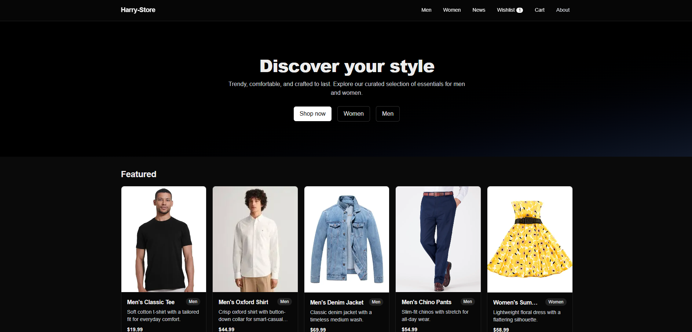
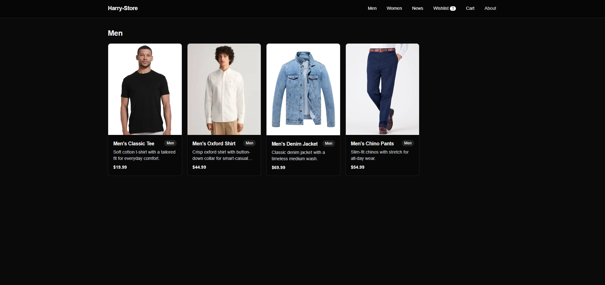
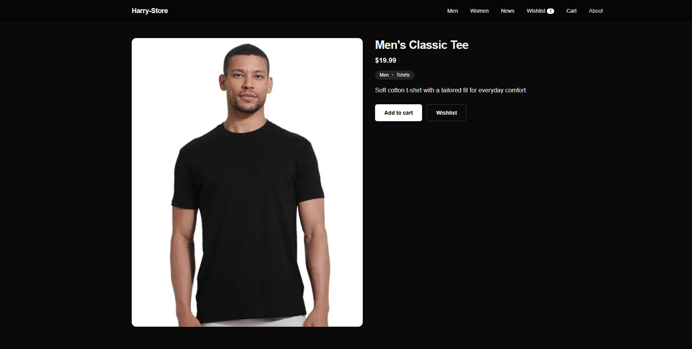
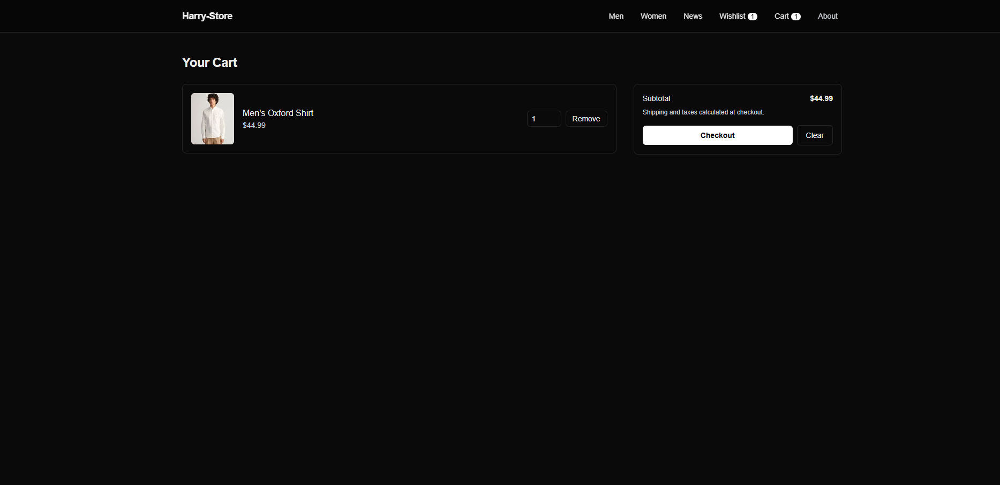
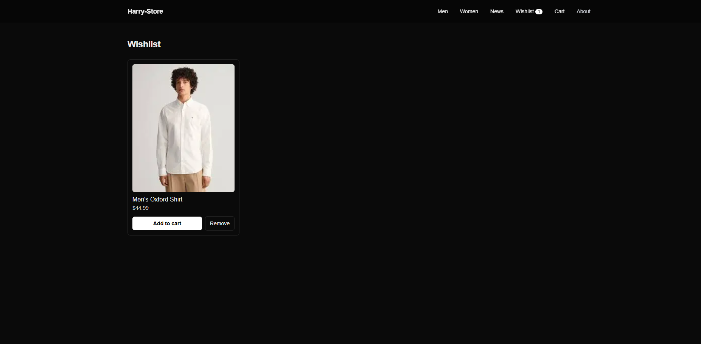
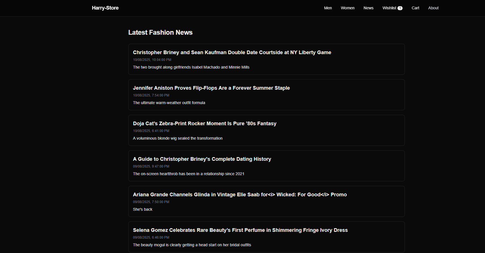

### Install & Run on Another PC (Clone from Git)

This section is for non-developers who just want to run the site locally.

- Requirements
  - Node.js LTS 20+ (includes npm)
  - Git
  - Optional: a modern browser (Chrome, Edge, Firefox)

- Steps
  1) Install Node.js LTS from `https://nodejs.org`
  2) Install Git from `https://git-scm.com/downloads`
  3) Open a terminal and clone the repo:

      ```bash
      git clone https://github.com/harisazfar/ecom-website.git
      cd ecom-website
      ```

  4) Install dependencies:

      ```bash
      npm install
      ```

  5) Start the site
      - Development (auto-reload):

        ```bash
        npm run dev
        ```

      - Production (optimized):

        ```bash
        npm run build
        npm run start
        ```

  6) Open `http://localhost:3000` in your browser

- Common issues
  - Port in use: if 3000 is busy, on Windows PowerShell run:

      ```powershell
      $env:PORT = 3001; npm run start
      ```

    On macOS/Linux:

      ```bash
      PORT=3001 npm run start
      ```

  - Private repo access: ensure your GitHub account has access, or use SSH instead of HTTPS.


### Developer Overview & Reference

### Project Summary — Harry-Store (Next.js 15 + Tailwind)

Responsive ecommerce storefront with men/women apparel, product detail pages, cart, wishlist, news feed, and merchant configuration.

### Features
- Product catalog with men/women filters and product detail pages
- Cart and wishlist with persistent state (localStorage)
- Toast notifications for add/remove/checkout
- News page aggregating fashion RSS feeds
- Merchant configuration: site name, currency/locale, and product source (static or JSON)

### Tech Stack
- Next.js 15 (App Router), React 19, TypeScript
- Tailwind CSS v4

### Quick Start (Developers)
1) Install dependencies:
```bash
npm install
```
2) Dev server:
```bash
npm run dev
```
3) Production build + start:
```bash
npm run build && npm run start
```

### Configuration (Merchants)
Edit `src/config/merchant.ts` to select a merchant via env var and to control product source:
- `NEXT_PUBLIC_MERCHANT`: defaults to `default`
- `productsSource`: `"static" | "json"`
- `productsJsonPath`: path to JSON file containing an array of `Product`

Price formatting uses `currency` and `locale` from the selected merchant.

### Products JSON format
When using the JSON source, provide an array of products with this shape:
```json
[
  {
    "id": "m-ts-001",
    "slug": "mens-classic-tee",
    "name": "Men's Classic Tee",
    "description": "Soft cotton t-shirt",
    "priceCents": 1999,
    "imageUrl": "/images/men/men-classic-tee.jpg",
    "category": "tshirts",
    "gender": "men"
  }
]
```

### Key Routes
- `/` home, featured products
- `/men`, `/women` category listings
- `/product/[handle]` product details (handle = product `id`)
- `/cart` cart with quantity updates and checkout (mock)
- `/cart/success` checkout confirmation
- `/wishlist` wishlist management
- `/news` fashion news from public RSS feeds

### Screenshots
Add PNG/JPG files to `docs/screenshots/` with these names and they will render below.








Tips
- Windows: Win+Shift+S to capture, then save to `docs/screenshots/`
- macOS: Shift+Cmd+4, save to `docs/screenshots/`

### Demo Video
Upload your demo to YouTube, Google Drive, or similar and paste the link here:

- Watch the demo: [Demo Video Link](https://your-demo-link.example)

### Project Structure (selected)
- `src/app/*` pages (App Router)
- `src/components/*` UI components (Header, Hero, ProductGrid, ProductCard, ToastProvider)
- `src/store/StoreProvider.tsx` cart/wishlist state (Context + localStorage)
- `src/data/products.ts` static seed products
- `src/data/catalog.ts` product loaders (static or JSON)
- `src/config/merchant.ts` merchant configuration
- `public/images/*` product images

### Documentation
- See `docs/TECHNICAL_SPEC.md` and `docs/BUSINESS_SOLUTION.md` for full details.

### License
Private/internal use.
